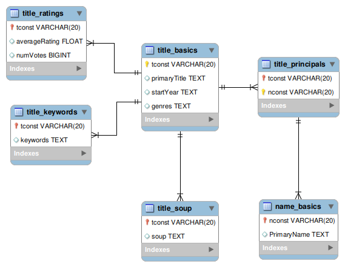
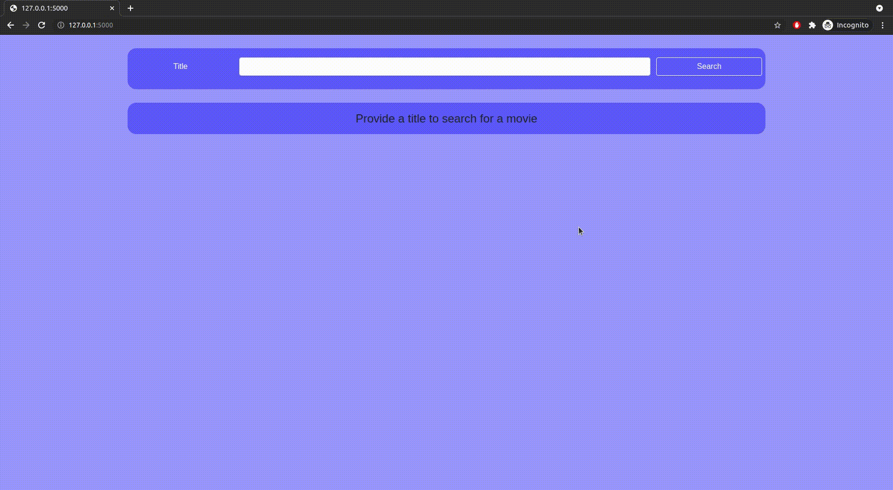
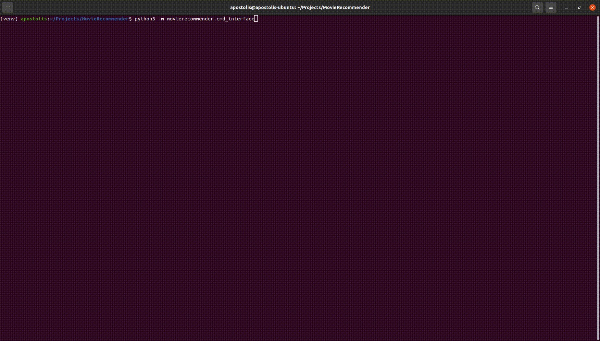

# Movie Recommender

---


## Data extraction

* Using the datasets from https://datasets.imdbws.com for basic info (imdb ids, cast, year, movie type, genres)

* Scraping IMDB for info that isn't included at the datasets (keywords)

This part of the project can be modified for use with other use cases (eg extracting data
for tv episodes or a specific type of film) but in this project we are only examining movies, so we filter the 
dataset to keep only the movies and relevant info.

The goal of this project isn't to provide a full database from the IMDB dataset (even though this can easily be managed
and assisted by the modules that are used), but to keep only relevant information that is used on finding
similar movies.

## Requirements

* An SQL server, currently the project is set up to use mysql, however you can use whatever
you want by modifying the sqlalchemy connection drivers on [datahandler/DbHandler](moviereccommender/../movierecommender/datahandler/DbHandler.py) class

* Credentials for the connection should be placed in data/creds.json which is not in version control, you can create it
  by modifying the template on [data/creds_template.json](data/creds_template.json) 

* The database Relational model looks as follows

   

  There is also a [dump file](docs/database/Mysql_dump_structure.sql) that can be used to create the schema from the beginning (generated
  from mysql, icnludes create schema)

* Package dependancies can be installed using pip
  
  ```pip install -r requirements.txt```

## Setup

1. Make sure the requirements above (python packages and database) are satisfied
2. Create the database schema, either by using the [dump file](docs/database/Mysql_dump_structure.sql) or by creating the tables manually based on the relational model. You could also leave it up to pandas Dataframe.my_sql function which can also create the tables if they don't exist, however this will not create the foreign key relations
3. Extract the data and populate the database. This can be done easily with [e2e_setup.py](movierecommender/datahandler/e2e_setup.py)
4. Once the database is populated, you have to create the plk file via Recommender.export_cosine_sim_to_pkl method on [Recommender.py](movierecommender/recommender/Recommender.py)

In case of an error tt any of those steps, running the unit tests can help the debugging process

## Flask / CLI apps

The main focus of the project is on the data collection and the creation of the recommendations

However I wanted to provide a simple UI, so I created a quick and simple [flask app](movierecommender/frontend/app.py) so the user
can search for a movie and find the recommendations



Additionally, I have created a quick [cli app](movierecommender/cmd_interface.py) which produces the recommendations
for a given tconst id (ids used from imdb for movies)



(The quality of the gifs isn't the greatest, there are also mp4 files uploaded:  [flask_demo.mp4](docs/demo/flask_demo.mp4) and [cli_demo.mp4](docs/demo/cli_demo.mp4))

Keep in mind however that as mentioned, these are only quick UIs and designed mainly for demo reasons. This means that they are by no means optional or complete applications, eg the flask app is just a very basic one, without form form sanitization, sql injection protection, testing, auth etc

## Testing

Python's [unittest](https://docs.python.org/3/library/unittest.html) framework is used for unit tests. All the tests exist on the /test package and can be run via
```
python3 -m unittest discover
```

## Considerations / Improvements
 
* Once the dataset is setup and the database initialized the overhead is the calculation of the cosine sim matrix.
Since the dataset is not predicted to change very often (the dataset should change only if we have new movies on
the title_keywords table, which will be pretty rare depending of course on the way you filter the movies you add
on the table) it is a lot more efficient to just calculate the matrix once and save it to a pkl file and read it from
there when it is needed, compared to recalculating it every time.
Read more about pickle with pandas [here](https://pandas.pydata.org/pandas-docs/stable/reference/api/pandas.DataFrame.to_pickle.html#pandas.DataFrame.to_pickle)
  
* Currently the method to calculate the similarity between the vector of movies is cosine similarity (more info
  [here](https://www.machinelearningplus.com/nlp/cosine-similarity/)). A possible improvement
  could be a use of a different method

* As any project relying on a dataset, the success is highly dependent on the quality of the dataset. Some possible
considerations to better process the dataset might be limiting the amount of keywords / extracting more relevant keywords,
  including other factors that might help find similar movies (eg other cast members, year), use of extra datasets from different sources etc

* Currently for demo purposes the project is set up to only keep 5% of the movies that the imdb tsv files contain (more than 500.000). This is done both for efficiency and the need to not bombard imdb.com with requests that are needed to scrap the keywords. The way decided to filter this top 5% is the # of ratings they have on imdb. You can see/change this filtering on the get_tconst_ids function on [WebScraper.py](movierecommender/datahandler/WebScraper.py)
  
  A possible improvement that could be done here would be to increase the amount of movies we keep, or find another method to filter the movies (or possible combinations of such methods)

## Notes

- [x] Dataset creation
- [x] Recommender engine
- [x] CLI app
- [x] Flask App  